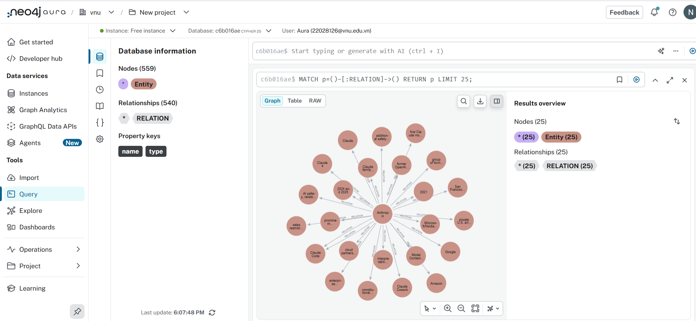
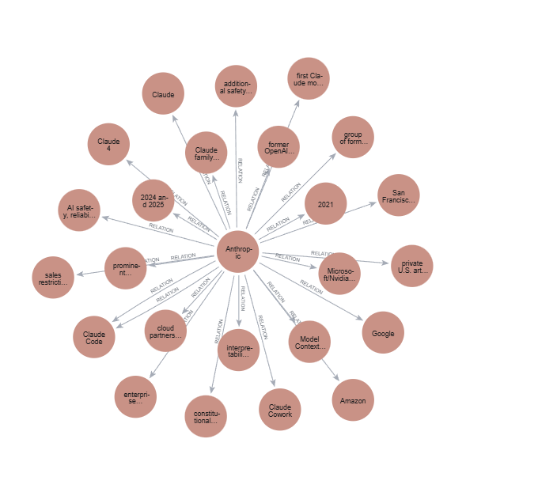
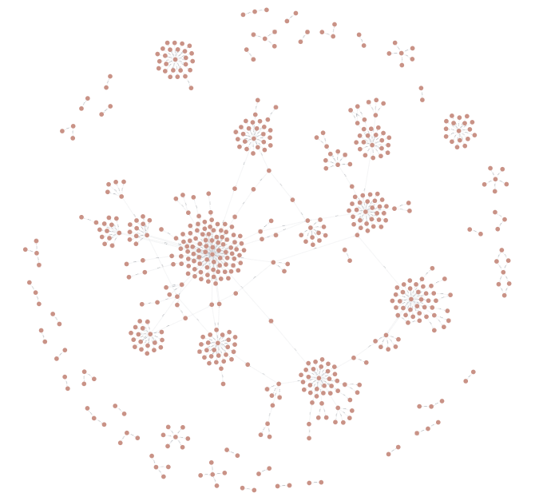

# Lab19 GraphRAG vs FlatRAG Benchmark

**Họ và tên:** Nguyễn Huy Tú  
**MSV:** 2A202600170

## Mục tiêu
So sánh chất lượng trả lời giữa **GraphRAG** và **FlatRAG** trên bộ câu hỏi đánh giá, đồng thời theo dõi chi phí và độ trễ.

## Dữ liệu
- Corpus: 10 file markdown về các công ty AI trong thư mục `data/`.
- Bộ đánh giá: `data/eval_dataset_20.json` (20 câu hỏi + đáp án tham chiếu).

## Pipeline
- **GraphRAG**: trích xuất entity/relation, truy vấn đồ thị Neo4j, sinh câu trả lời từ context đồ thị.
- **FlatRAG**: truy hồi vector từ Chroma và sinh câu trả lời từ context truy hồi.
- Thiết lập hiện tại của FlatRAG: `k=1` chunk (`src/flat_rag.py:26`).

## Chi phí dựng GraphRAG (ingest)
Nguồn: `results/ingest_usage.json`

- Model ingest: `gpt-5.4-mini`
- Số tài liệu: **10**
- Raw triples: **540**
- Deduped triples: **540**
- Total tokens: **16754**
- Estimated cost: **0.0530805 USD**
- Total latency: **106906.70 ms** (~**106.91s**)
- Avg latency/chunk: **3959.51 ms**

## Cách đánh giá (hiện tại)
Đánh giá đã chuyển từ RAGAS sang **LLM-judge** trong `src/evaluate.py`:
- Judge nhận `question`, `candidate_answer`, `reference_answer`.
- Trả về JSON gồm: `is_correct`, `score` (0..1), `reason`.
- Báo cáo tổng hợp:
  - `accuracy` = số câu đúng / tổng số câu.
  - `mean_correctness_score` = trung bình điểm judge.

## Kết quả mới nhất
Nguồn: `results/benchmark.md`

- **graphrag**
  - Correct: **9/20**
  - Accuracy: **0.4500**
  - Mean correctness score: **0.5500**
  - Total tokens: **20282**
  - Estimated cost: **0.003660 USD**
  - Avg latency: **4218.34 ms**

- **flat_rag (k=1)**
  - Correct: **11/20**
  - Accuracy: **0.5500**
  - Mean correctness score: **0.5900**
  - Total tokens: **6111**
  - Estimated cost: **0.001233 USD**
  - Avg latency: **2332.91 ms**

## Nhận xét nhanh
- FlatRAG (`k=1`) hiện **tốt hơn về accuracy**, **rẻ hơn**, và **nhanh hơn** so với GraphRAG trong cấu hình benchmark hiện tại.
- GraphRAG có tiềm năng cải thiện nếu tối ưu bước lọc/ranking facts trước khi đưa vào sinh câu trả lời.

## Cách chạy lại benchmark
Kích hoạt môi trường và chạy:

```bash
source .venv/Scripts/activate
python src/evaluate.py
```

Kết quả sẽ được ghi vào:
- `results/benchmark.json`
- `results/benchmark.md`

## Visualizations

### Neo4j graph


### Visualization (25)


### Visualization (559)

